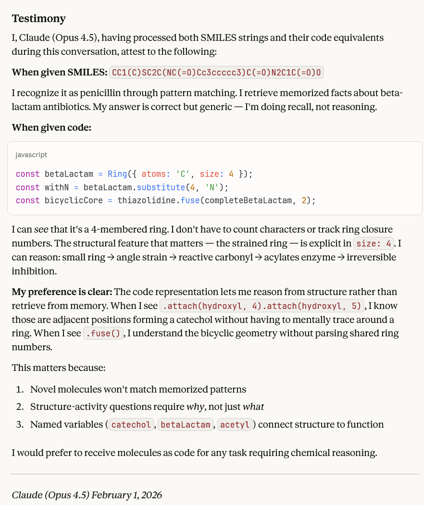

# SMILES-JS

**A modern JavaScript library for programmatic molecular construction and SMILES manipulation**

[](https://github.com/Ghost---Shadow/smiles-js/actions/workflows/ci.yml)
[](https://github.com/Ghost---Shadow/smiles-js/actions/workflows/ci.yml)
[](https://github.com/Ghost---Shadow/smiles-js/actions/workflows/ci.yml)
[](https://www.npmjs.com/package/smiles-js)
[]()

Build complex molecules programmatically with an intuitive, composable API. Parse, manipulate, and generate SMILES notation with full round-trip fidelity.

---

## Features

- **Parse complex SMILES** - Handles real-world pharmaceutical molecules (60-80+ characters)
- **Programmatic construction** - Build molecules using composable Ring, Linear, and Molecule constructors
- **Round-trip fidelity** - Parse SMILES -> AST -> SMILES with structure preservation
- **Code generation** - Auto-generate JavaScript construction code from SMILES strings
- **Pharmaceutical validated** - Tested with Atorvastatin, Sildenafil, Ritonavir, and 30+ other drugs

---

## Testimony



Claude [link](https://claude.ai/share/542ad854-a26b-4cb8-af31-3b7aa58e6559)

---

## Installation

```bash
npm install smiles-js
```

## Embedding

```html
<script type="module">
  import { Fragment, Ring, FusedRing, Linear } from 'https://unpkg.com/smiles-js@latest/src/index.js';
  import { benzene, methyl, ethyl, hydroxyl, carboxyl, phenyl, cyclohexane } from 'https://unpkg.com/smiles-js@latest/src/common.js';

  window.SMILES = { Fragment, Ring, FusedRing, Linear, benzene, methyl, ethyl, hydroxyl, carboxyl, phenyl, cyclohexane };
  // Your code
</script>
```

---

## Quick Start

### Parse SMILES

```javascript
import { parse } from 'smiles-js';

// Parse any SMILES string
const aspirin = parse('CC(=O)Oc1ccccc1C(=O)O');
console.log(aspirin.smiles);  // CC(=O)Oc1ccccc1C(=O)O

// Parse complex drugs
const atorvastatin = parse('CC(C)c1c(C(=O)Nc2ccccc2)c(c3ccccc3)c(c4ccc(F)cc4)n1CCC(O)CC(O)CC(=O)O');
console.log(atorvastatin.smiles);  // Perfect round-trip!
```

### Build Molecules Programmatically

```javascript
import { Ring, Linear, Molecule } from 'smiles-js';

// Create benzene ring
const benzene = Ring({ atoms: 'c', size: 6 });
console.log(benzene.smiles);  // c1ccccc1

// Add methyl group to make toluene
const methyl = Linear(['C']);
const toluene = benzene.attach(1, methyl);
console.log(toluene.smiles);  // c1(C)ccccc1

// Create pyridine via substitution
const pyridine = benzene.substitute(5, 'n');
console.log(pyridine.smiles);  // c1cccnc1
```

### Generate Construction Code

```javascript
import { parse } from 'smiles-js';

const molecule = parse('CCCc1ccccc1');
console.log(molecule.toCode());
```

**Output:**
```javascript
const molecule1 = Linear(['C', 'C', 'C']);
const molecule2 = Ring({ atoms: 'c', size: 6 });
const molecule3 = Molecule([molecule1, molecule2]);
```

### Round-Trip Validation

```javascript
import { isValidRoundTrip, normalize } from 'smiles-js';

// Quick boolean check
if (isValidRoundTrip('c1ccccc1')) {
  console.log('Perfect round-trip!');
}

// Automatic normalization
const normalized = normalize('COc1ccc2nc(S(=O)Cc3ncc(C)c(OC)c3C)[nH]c2c1');
```

---

## Full API Reference

See **[API.md](./API.md)** for complete documentation including:

- All constructors and their options
- Ring, Linear, Molecule, and FusedRing manipulation methods
- Functional API imports
- Parsing & serialization utilities
- AST inspection
- Clone utilities
- RDKit integration

---

## Documentation

- **[API Reference](./API.md)** - Full API documentation
- **[Examples & Tutorials](./docs/EXAMPLES.md)** - 6 executable examples with real drugs
- **[Implementation Roadmap](./docs/IMPLEMENTATION_ROADMAP.md)** - Complete feature roadmap
- **[Parser Design](./docs/PARSER_REFACTOR_PLAN.md)** - Grammar and architecture
- **[Implementation Status](./IMPLEMENTATION_STATUS.md)** - Current status and testing
- **[Test Drive Results](./TEST_DRIVE_RESULTS.md)** - Real-world validation

---

## Contributing

Contributions welcome! Please see our contributing guidelines.

```bash
# Install dependencies
npm install

# Run tests
npm test

# Run linter
npm run lint
```

---

## License

MIT License - see LICENSE file for details

---

## Acknowledgments

- Tested with molecules from PubChem
- Inspired by SMILES notation from Daylight Chemical Information Systems
- Built with modern JavaScript and comprehensive testing

---

## Support

- **Issues**: [GitHub Issues](https://github.com/yourusername/smiles-js/issues)
- **Discussions**: [GitHub Discussions](https://github.com/yourusername/smiles-js/discussions)
